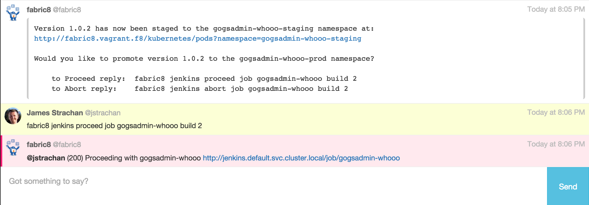

# Fabric8 DevOps Workflow Steps

Provides Jenkins Workflow Steps for working with [Fabric8 DevOps](http://fabric8.io/guide/cdelivery.html) in particular for clean integration with the [Hubot chat bot](https://hubot.github.com/) and human approval

<p align="center">
  <a href="http://fabric8.io/guide/cdelivery.html">
  	
  </a>
</p>


The following jenkins workflow steps are available if you add this plugin to your Jenkins:

### hubot

Allows sending of a message to the hubot chat bot

```
hubot room: 'foo', message: 'hello world!'
```

If the room `foo` does not already exist its created on the fly

### hubotProject

Allows sending of a message to the default chat room for a project build (using the `fabric8.yml` file to find the chat room for a project).

If no chat room is defined for a project then it uses the environment variable `$FABRIC8_DEFAULT_HUBOT_ROOM`

```
hubotProject 'hello world!'
```

### hubotApprove

Sends a hubot message the project chat room for a project when the build is waiting for user input with the hubot commands to proceed or abort the build.

```
hubotApprove "Do you want to stage?"
input id: 'Proceed', message: "Staging?"
```

Here's an example of the `hubotApprove` step inside [Let's Chat](http://sdelements.github.io/lets-chat/):



This goal is part of the reusable [maven/CanaryReleaseStageAndApprovePromote.groovy](https://github.com/fabric8io/jenkins-workflow-library/blob/master/maven/CanaryReleaseStageAndApprovePromote.groovy) Jenkins workflow script in the default [Fabric8 DevOps library of Jenkins Workflows](https://github.com/fabric8io/jenkins-workflow-library) which can be used on any Maven based project created via the [Fabric8 DevOps tooling](ttp://fabric8.io/guide/cdelivery.html) or [console](ttp://fabric8.io/guide/cdelivery.html).

The behaviour of this script is to:

* perform a canary release of all maven artifacts and docker images
* run automated [Kuberentes integration tests](http://fabric8.io/guide/testing.html) in a brand new kubernetes environment with all the docker images and kubernetes resources (pods, replication controllers, services etc)
* stage the canary release to a staging environment
* ask the user to prompt if it should be promoted to a production environment
* if successful the release is promoted to production

### parameterOrDefault

Evaluates a build parameter value of the given name or returns a default value

```
def something = parameterOrDefault parameter: 'FOO', defaultValue: 'bar'
echo "I have a value ${something}" 
```
This makes it really easy in a 1 liner to define a variable for an optional build parameter in a reusable workflow script which if the build parameter is not defined then you can provide a default value.

